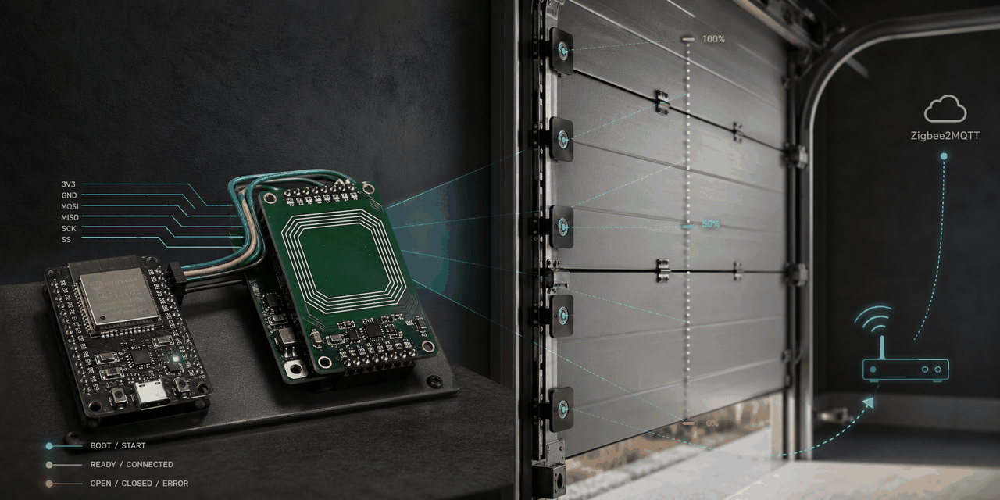

# NFC Garage Position Sensor


ESP32-C6 firmware for a garage door position sensor that reads fixed PN532 NFC tags and reports the current opening percentage to Zigbee2MQTT over Zigbee.

Current release: `0.4.0`



## Why This Project

This project is meant for makers who want reliable garage door position feedback without mechanical encoders, cloud dependencies, or a custom backend. The sensor watches fixed NFC tags along the door travel path and publishes:

- `0 %` when the door is closed
- `100 %` when the door is fully open
- intermediate values for known positions in between

The released firmware focuses on a simple maintenance model:

- USB flashing only
- Zigbee end-device operation
- local status feedback via the onboard WS2812 LED
- optional BLE UART diagnostics for garage-side debugging

## What You Need

### Core Hardware

- 1x ESP32-C6 dev board with onboard WS2812 LED
- 1x PN532 NFC module with SPI support
- 10x fixed NFC tags for the garage door travel path
- jumper wires, USB cable, and a stable mounting solution for board, reader, and tags

See the full parts list in [docs/bom.md](./docs/bom.md) and the detailed wiring guide in [docs/hardware-setup.md](./docs/hardware-setup.md).

### Software

- Arduino IDE with ESP32 support, or an equivalent `arduino-cli` setup
- ESP32 board target: `ESP32C6 Dev Module`
- Zigbee2MQTT for integration

## Quick Start

1. Read [docs/hardware-setup.md](./docs/hardware-setup.md) and wire the ESP32-C6 to the PN532.
2. Follow [docs/assembly.md](./docs/assembly.md) to place the reader and tags on the garage door path.
3. Build the firmware with `.\tools\firmware\build.ps1`.
4. Flash the device with `.\tools\firmware\flash.ps1`.
5. Pair it in Zigbee2MQTT and, if needed, use [`zigbee2mqtt/external_converters/nfc-garage-position-sensor.js`](./zigbee2mqtt/external_converters/nfc-garage-position-sensor.js).
6. Validate the `0 %` and `100 %` tags and confirm LED behavior with [docs/status-led.md](./docs/status-led.md) and [docs/tag-layout.md](./docs/tag-layout.md).

## Features

- Reads passive NFC tags through a PN532 over SPI
- Maps known tag UIDs to a logical garage door opening percentage
- Reports `position` and `state` over Zigbee with `0 = closed` and `100 = open`
- Publishes both Basic `appVersion` and `swBuildId` for Zigbee2MQTT firmware metadata
- Actively reports live position updates even when Zigbee2MQTT skips converter `configure()`
- Uses the onboard WS2812 LED for local runtime status
- Supports local button diagnostics and factory reset
- Supports optional BLE UART diagnostics in a dedicated debug build

## Hardware Overview

### Known Working Hardware

| Component | Tested role | Notes |
|-----------|-------------|-------|
| ESP32-C6 Dev Module | Main controller and Zigbee radio | Requires `Zigbee ED` mode |
| PN532 NFC module | Tag reader | Use SPI mode |
| Onboard WS2812 LED | Status indicator | Used for boot/join/runtime state |
| Onboard button | Diagnostics / factory reset | Short press for status, long press for reset |
| Fixed NFC tags | Position reference points | Current release uses 10 tags |

### Pin Summary

| Signal | Pin |
|--------|-----|
| `PIN_SPI_SCK` | `20` |
| `PIN_SPI_MISO` | `19` |
| `PIN_SPI_MOSI` | `18` |
| `PIN_PN532_SS` | `14` |
| `BUTTON_PIN` | `9` |

For wiring details, setup notes, and the diagram assets, see [docs/hardware-setup.md](./docs/hardware-setup.md).

## Firmware Behavior

### Position Semantics

This project keeps the user-facing door position in the intuitive form:

- `0 %` = closed
- `100 %` = open

Internally, the Zigbee Window Covering cluster uses inverted lift semantics, so the sketch translates the logical opening percentage before publishing it. Zigbee2MQTT should normally use `invert_cover = false`.

### Tag Layout

The current release uses 10 fixed tags ordered from closed to open. With `INDEX_INCREASES_WHEN_OPENING = true`, the first configured tag represents `0 %` and the last represents `100 %`.

See [docs/tag-layout.md](./docs/tag-layout.md) for the complete mapping.

### LED Status

| State | LED behavior |
|-------|--------------|
| Boot | Short white flash |
| Startup / early join | Slow blue blink |
| Zigbee not ready after stack start | Fast blue blink |
| Ready, no confirmed tag yet | Very dim green |
| Confirmed closed (`0 %`) | Green |
| Confirmed non-closed (`> 0 %`) | Orange |
| Fatal startup error | Red blink |

See [docs/status-led.md](./docs/status-led.md) for the detailed validation flow.

## Build, Flash, And Pair

The sketch lives under `src/nfc-garage-position-sensor` and the helper scripts live under `tools/firmware`.

### Common Commands

```powershell
.\tools\firmware\build.ps1
.\tools\firmware\flash.ps1
.\tools\firmware\monitor.ps1
```

Clean flash for a fresh Zigbee join:

```powershell
.\tools\firmware\flash-clean.ps1
```

If PowerShell blocks local scripts:

```powershell
powershell -ExecutionPolicy Bypass -File .\tools\firmware\build.ps1
powershell -ExecutionPolicy Bypass -File .\tools\firmware\flash.ps1
powershell -ExecutionPolicy Bypass -File .\tools\firmware\monitor.ps1
```

BLE debug build:

```powershell
.\tools\firmware\build.ps1 -EnableBleDebug
.\tools\firmware\flash.ps1 -EnableBleDebug
```

Versioned local binaries are copied into `bin/` during builds. These are local convenience artifacts and are not part of the public source workflow.

### Arduino IDE Settings

Tested with:

- Board: `ESP32C6 Dev Module`
- Zigbee Mode: `Zigbee ED`
- Partition Scheme: `zigbee`
- CDC On Boot: `cdc`

### Windows-First Tooling

The provided helper scripts are PowerShell-based and primarily documented for Windows. Advanced users can adapt the same workflow to their own `arduino-cli` setup if they prefer another environment.

## Zigbee2MQTT Setup

The device exposes:

- endpoint `10`: Window Covering
- Basic `modelId`
- Basic `manufacturerName`
- Basic `powerSource`
- Basic `appVersion`
- Basic `swBuildId`

If Zigbee2MQTT needs help classifying the device, use the repository-provided external converter:

- [zigbee2mqtt/external_converters/nfc-garage-position-sensor.js](./zigbee2mqtt/external_converters/nfc-garage-position-sensor.js)

For full pairing notes and expected payload behavior, see [docs/z2m-setup.md](./docs/z2m-setup.md).

## Verification

After flashing and pairing, verify the following:

1. The board boots and shows the documented LED startup pattern.
2. Zigbee2MQTT interviews the device and shows it as a Window Covering style device.
3. The `0 %` tag reports `position: 0`.
4. The `100 %` tag reports `position: 100`.
5. Intermediate tags produce stable intermediate percentages.

## Optional Integrations

### FHEM

FHEM support stays available as an optional advanced integration. The repo includes:

- [examples/fhem-mqtt2-device-template.txt](./examples/fhem-mqtt2-device-template.txt)
- FHEM guidance in [docs/z2m-setup.md](./docs/z2m-setup.md)

### Local Diagnostics

Short serial capture:

```powershell
.\tools\firmware\serial-capture.ps1 -Port COM3 -DurationSeconds 30 -OutputFile .\tmp\serial.log
```

Short MQTT capture using example placeholder values:

```powershell
.\tools\mqtt-capture.ps1 -BrokerHost <broker-host> -DeviceId <zigbee-device-id> -DurationSeconds 30 -OutputFile .\tmp\mqtt.log
```

## Repository Layout

- `src/nfc-garage-position-sensor`: firmware sketch and local source files
- `tools/firmware`: build, flash, monitor, and serial-capture helpers
- `docs`: public project documentation
- `examples`: optional integration examples
- `zigbee2mqtt`: repository-owned Zigbee2MQTT converter files

## Further Documentation

- [docs/hardware-setup.md](./docs/hardware-setup.md)
- [docs/assembly.md](./docs/assembly.md)
- [docs/bom.md](./docs/bom.md)
- [docs/quick-verification.md](./docs/quick-verification.md)
- [docs/status-led.md](./docs/status-led.md)
- [docs/tag-layout.md](./docs/tag-layout.md)
- [docs/z2m-setup.md](./docs/z2m-setup.md)
- [docs/nfc-garage-position-sensor-fsd.md](./docs/nfc-garage-position-sensor-fsd.md)

## Contributing

Please read [CONTRIBUTING.md](./CONTRIBUTING.md) before opening a pull request or large feature request.

## License

This project is licensed under the GPLv3 license. See [LICENSE](./LICENSE).
