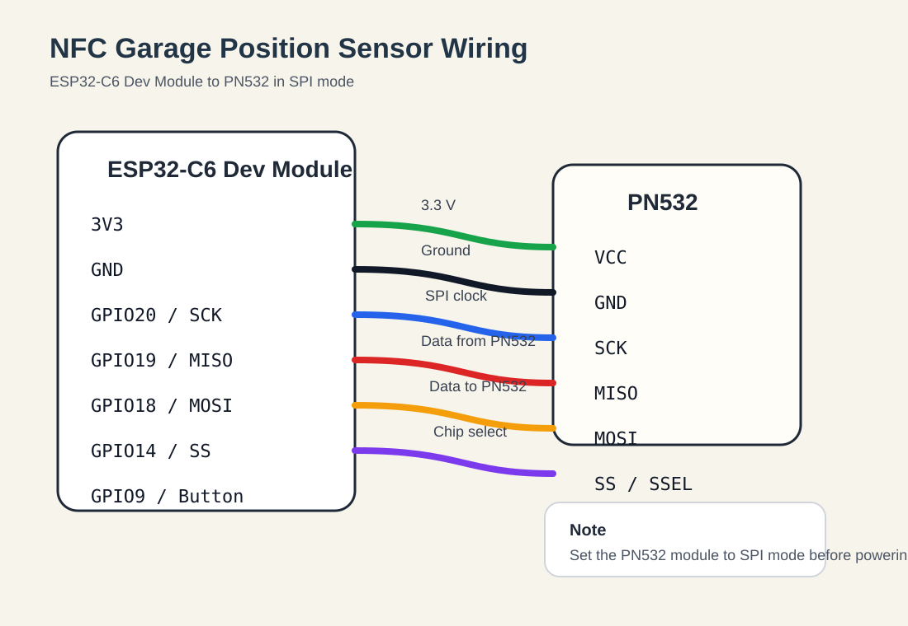
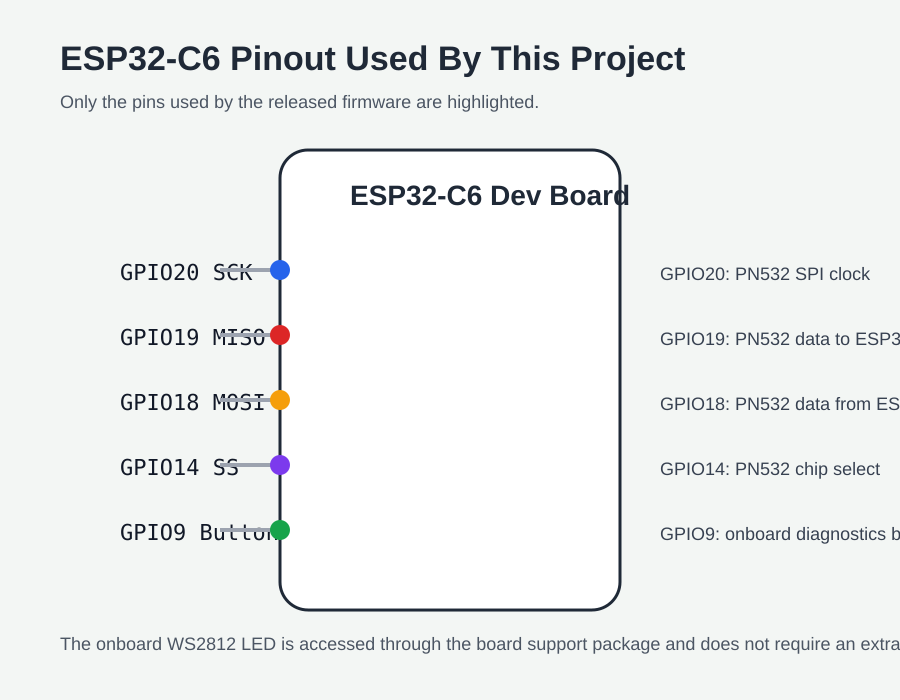

# Hardware Setup

This project was validated with an `ESP32C6 Dev Module` and a `PN532` NFC module in SPI mode.

## Known Working Hardware

| Component | Quantity | Notes |
|-----------|----------|-------|
| ESP32-C6 Dev Module | 1 | Zigbee end device controller |
| PN532 NFC module | 1 | Must support SPI mode |
| NFC tags | 10 | Fixed along the garage door travel path |
| Jumper wires | as needed | Keep SPI wiring short and stable |
| USB cable | 1 | For power, flashing, and serial monitoring |
| Mounting material | as needed | Double-sided tape, brackets, or screws depending on installation |

## SPI Wiring

| ESP32-C6 pin | PN532 pin | Purpose |
|--------------|-----------|---------|
| `20` | `SCK` | SPI clock |
| `19` | `MISO` | SPI data from PN532 |
| `18` | `MOSI` | SPI data to PN532 |
| `14` | `SS` / `SSEL` | PN532 chip select |
| `3V3` | `VCC` | Power supply |
| `GND` | `GND` | Shared ground |

## Wiring Diagram

## Pinout Graphic

## Setup Notes

- Configure the PN532 for SPI before powering the system.
- Keep the NFC reader cable run short to reduce signal problems.
- Mount the PN532 so it sees the tags repeatably during door movement.
- Use a stable 3.3 V supply from the dev board and a clean shared ground.
- The onboard button and WS2812 LED are used by the firmware and do not need extra external wiring.

## Software Settings Tied To The Hardware

Use these Arduino IDE settings:

- Board: `ESP32C6 Dev Module`
- Zigbee Mode: `Zigbee ED`
- Partition Scheme: `zigbee`
- CDC On Boot: `cdc`

## Next Steps

After wiring the hardware:

1. Read [assembly.md](./assembly.md) for physical installation guidance.
2. Review [tag-layout.md](./tag-layout.md) for the released 10-tag mapping.
3. Build and flash the firmware using the commands in the [README](../README.md).
